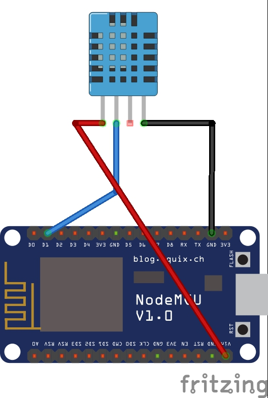
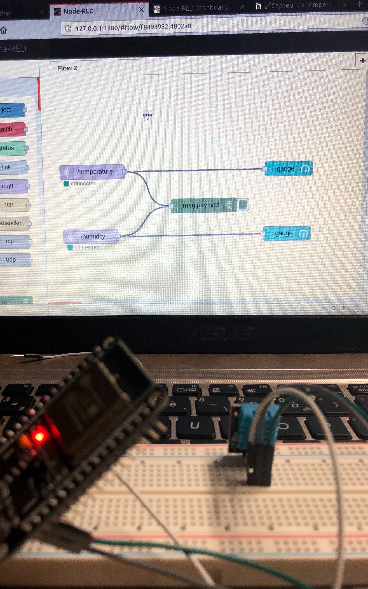

# WeatherStationIoT

Weather Station Connected with Node-RED

Ce projet à été réalisé par [@siham](https://github.com/siham87) 
## Video :
[](https://www.youtube.com/watch?v=_VJEbB0QMjM)


## **Bibliothéque utilisée**
+ adafruit-MQTT : [https://github.com/adafruit/Adafruit_MQTT_Library)
+ Wifi : [https://github.com/esp8266/Arduino/tree/master/libraries/ESP8266WiFi)
+ uTimerLib : [https://github.com/Naguissa/uTimerLib)
+ DHT-sensor-library : [https://github.com/siham87/WeatherStationIoT/edit/master/README.md)

## **Matériel**
+ esp8266
+ temperature sensor


## **Montage**



## **Code**

```
#include <ESP8266WiFi.h>
#include <Adafruit_MQTT.h>
#include <Adafruit_MQTT_Client.h>
#include <DHT.h>
#include <uTimerLib.h>

DHT dht(5, DHT11);
WiFiClient wiFiClient;
Adafruit_MQTT_Client mqttClient(&wiFiClient, "192.168.0.103", 1883);
Adafruit_MQTT_Publish temperaturePublisher(&mqttClient, "/temperature");
Adafruit_MQTT_Publish humiditePublisher(&mqttClient, "/humidite");


void sendData() {
  int temperature = dht.readTemperature();
  int humidity = dht.readHumidity();
  temperaturePublisher.publish(temperature);
  humiditePublisher.publish(humidity);
}


void setup() {

  dht.begin();
  
  Serial.begin(115200);

  WiFi.begin("createch2019", "createch2019");
  delay(5000);
  Serial.print("IP address: ");
  Serial.println(WiFi.localIP());
  TimerLib.setInterval_s(sendData, 2);
}

void loop() {

  if (mqttClient.connected()) {
    mqttClient.processPackets(10000);
    mqttClient.ping();
  } else {
    mqttClient.disconnect();
    mqttClient.connect();
  }


 

}
```
## **Node-Red**


